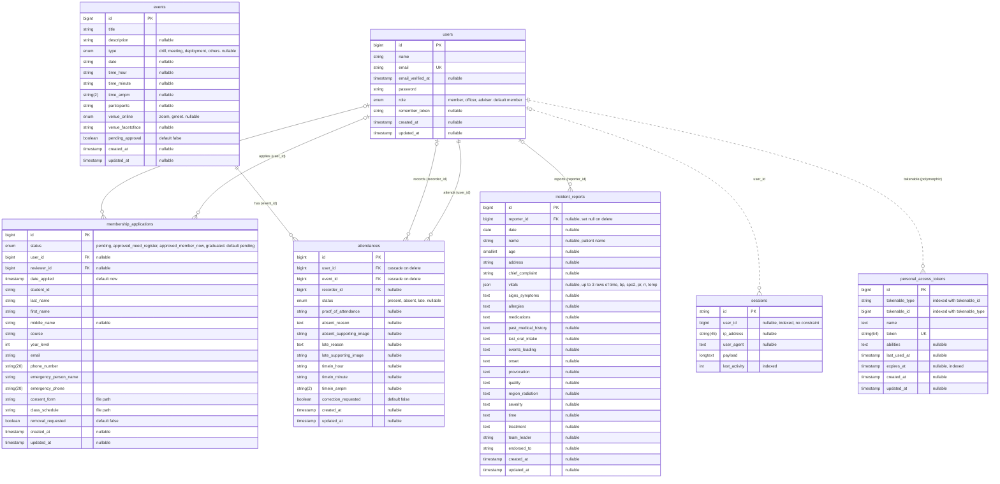
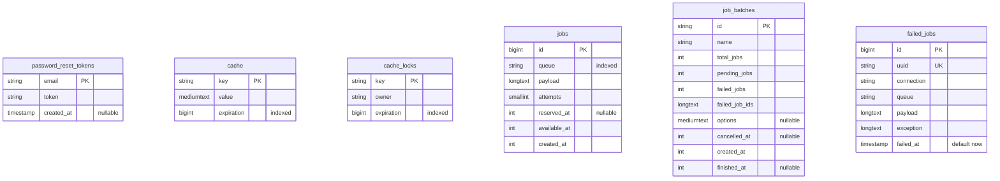

# DRRT-IMS Database ERD

Generated from `backend/database/migrations`.

```mermaid
erDiagram
    users |o--o{ membership_applications : "applies (user_id)"
    users |o--o{ membership_applications : "reviews (reviewer_id)"
    users ||--o{ attendances : "attends (user_id)"
    users |o--o{ attendances : "records (recorder_id)"
    events ||--o{ attendances : "has (event_id)"
    users |o--o{ incident_reports : "reports (reporter_id)"
    users |o..o{ sessions : "user_id"
    users ||..o{ personal_access_tokens : "tokenable (polymorphic)"

    users {
        bigint id PK
        string name
        string email UK
        timestamp email_verified_at "nullable"
        string password
        enum role "member, officer, adviser. default member"
        string remember_token "nullable"
        timestamp created_at "nullable"
        timestamp updated_at "nullable"
    }

    membership_applications {
        bigint id PK
        enum status "pending, approved_need_register, approved_member_now, graduated. default pending"
        bigint user_id FK "nullable"
        bigint reviewer_id FK "nullable"
        timestamp date_applied "default now"
        string student_id
        string last_name
        string first_name
        string middle_name "nullable"
        string course
        int year_level
        string email
        string(20) phone_number
        string emergency_person_name
        string(20) emergency_phone
        string consent_form "file path"
        string class_schedule "file path"
        boolean removal_requested "default false"
        timestamp created_at "nullable"
        timestamp updated_at "nullable"
    }

    events {
        bigint id PK
        string title
        string description "nullable"
        enum type "drill, meeting, deployment, others. nullable"
        string date "nullable"
        string time_hour "nullable"
        string time_minute "nullable"
        string(2) time_ampm "nullable"
        string participants "nullable"
        enum venue_online "zoom, gmeet. nullable"
        string venue_facetoface "nullable"
        boolean pending_approval "default false"
        timestamp created_at "nullable"
        timestamp updated_at "nullable"
    }

    attendances {
        bigint id PK
        bigint user_id FK "cascade on delete"
        bigint event_id FK "cascade on delete"
        bigint recorder_id FK "nullable"
        enum status "present, absent, late. nullable"
        string proof_of_attendance "nullable"
        text absent_reason "nullable"
        string absent_supporting_image "nullable"
        text late_reason "nullable"
        string late_supporting_image "nullable"
        string timein_hour "nullable"
        string timein_minute "nullable"
        string(2) timein_ampm "nullable"
        boolean correction_requested "default false"
        timestamp created_at "nullable"
        timestamp updated_at "nullable"
    }

    incident_reports {
        bigint id PK
        bigint reporter_id FK "nullable, set null on delete"
        date date "nullable"
        string name "nullable, patient name"
        smallint age "nullable"
        string address "nullable"
        string chief_complaint "nullable"
        json vitals "nullable, up to 3 rows of time, bp, spo2, pr, rr, temp"
        text signs_symptoms "nullable"
        text allergies "nullable"
        text medications "nullable"
        text past_medical_history "nullable"
        text last_oral_intake "nullable"
        text events_leading "nullable"
        text onset "nullable"
        text provocation "nullable"
        text quality "nullable"
        text region_radiation "nullable"
        text severity "nullable"
        text time "nullable"
        text treatment "nullable"
        string team_leader "nullable"
        string endorsed_to "nullable"
        timestamp created_at "nullable"
        timestamp updated_at "nullable"
    }

    sessions {
        string id PK
        bigint user_id "nullable, indexed, no constraint"
        string(45) ip_address "nullable"
        text user_agent "nullable"
        longtext payload
        int last_activity "indexed"
    }

    personal_access_tokens {
        bigint id PK
        string tokenable_type "indexed with tokenable_id"
        bigint tokenable_id "indexed with tokenable_type"
        text name
        string(64) token UK
        text abilities "nullable"
        timestamp last_used_at "nullable"
        timestamp expires_at "nullable, indexed"
        timestamp created_at "nullable"
        timestamp updated_at "nullable"
    }
```

## Laravel framework tables

These tables have no relationships to the tables above.

```mermaid
erDiagram
    password_reset_tokens {
        string email PK
        string token
        timestamp created_at "nullable"
    }

    cache {
        string key PK
        mediumtext value
        bigint expiration "indexed"
    }

    cache_locks {
        string key PK
        string owner
        bigint expiration "indexed"
    }

    jobs {
        bigint id PK
        string queue "indexed"
        longtext payload
        smallint attempts
        int reserved_at "nullable"
        int available_at
        int created_at
    }

    job_batches {
        string id PK
        string name
        int total_jobs
        int pending_jobs
        int failed_jobs
        longtext failed_job_ids
        mediumtext options "nullable"
        int cancelled_at "nullable"
        int created_at
        int finished_at "nullable"
    }

    failed_jobs {
        bigint id PK
        string uuid UK
        string connection
        string queue
        longtext payload
        longtext exception
        timestamp failed_at "default now"
    }
```
